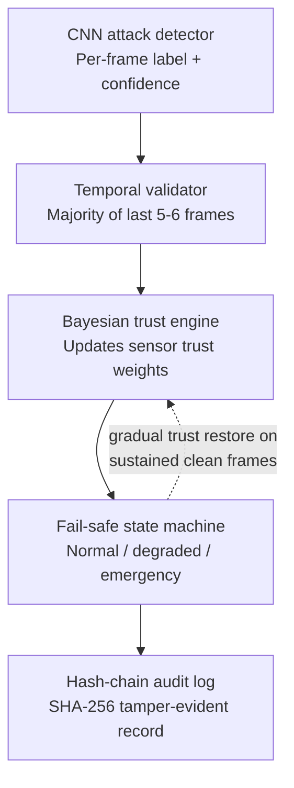
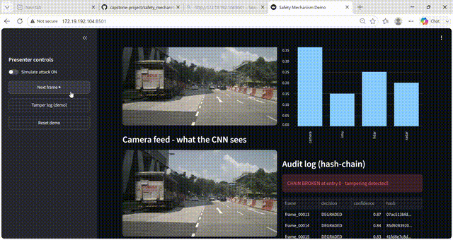

# Safety Mechanism (Objective 2)

Bayesian sensor-fusion fallback system for the ResilientVision-Autonomous
project. When the CNN attack-detector (Objective 1) flags a camera frame as
possibly corrupted by a rolling-shutter laser attack, this module decides
whether to trust that signal, shifts navigation trust away from the camera
toward LiDAR/Radar/IMU, switches the vehicle into a safer navigation mode if
needed, and records every confirmed attack event in a tamper-evident log.

## How it works



1. **Temporal validator** - ignores a single noisy frame from the CNN;
   only confirms an attack when 4+ of the last 6 frames agree.
2. **Bayesian trust engine** - on a confirmed attack, camera trust drops
   sharply; on sustained clean frames, trust recovers gradually (not
   instantly) - grounded in Hallyburton & Pajic, *"Bayesian Methods for
   Trust in Collaborative Multi-Agent Autonomy"* (2024).
3. **Fail-safe state machine** - `NORMAL -> DEGRADED -> EMERGENCY_STOP`,
   with gradual restore back to `NORMAL` once the attack clears.
4. **Hash-chain audit log** - every confirmed attack event is logged with
   a SHA-256 hash of the previous entry, so any edit to a past record is
   detectable (design follows Schneier & Kelsey's secure audit log scheme).

## Files

| File | What it does |
|---|---|
| `trust_engine.py` | Bayesian sensor trust weighting (standalone, no ROS) |
| `temporal_validator.py` | Majority-of-6-frame attack confirmation (standalone, no ROS) |
| `failsafe_state_machine.py` | Navigation state transitions (standalone, no ROS) |
| `hash_chain_logger.py` | Tamper-evident audit logging (standalone, no ROS) |
| `nuscenes_publisher.py` | Plays a nuScenes Mini scene as live ROS 2 topics (camera/lidar/radar/imu) |
| `stub_cnn_publisher.py` | Simulates the CNN's output on `/detector/attack_status` for independent development/testing |
| `demo_dashboard.py` | Streamlit presentation dashboard - live camera feed, trust weights, vehicle state, audit log |
| `safety_mechanism_blueprint.md` | Full build checklist and design notes |


## Running the ROS 2 pipeline

Requires ROS 2 Jazzy and nuScenes Mini (see `safety_mechanism_blueprint.md`
for full environment setup steps).

```bash
# Terminal 1 - play sensor data
python3 nuscenes_publisher.py --dataroot ~/data/nuscenes --scene-idx 0 --rate 2.0 --loop

# Terminal 2 - simulate the CNN's output
python3 stub_cnn_publisher.py --pattern sustained_attack --rate 2.0

# Terminal 3 - inspect topics
ros2 topic list
ros2 topic echo /detector/attack_status
```

## Running the presentation dashboard

```bash
pip install streamlit pillow
streamlit run demo_dashboard.py -- --frames-dir frames
```
Opens a browser dashboard with presenter-controlled attack toggle, live
trust weights, vehicle state, and a "tamper log" button that demonstrates
the hash-chain catching a tampered record in real time.

## Demo




## Status

- [x] Environment setup (ROS 2 Jazzy, nuScenes Mini)
- [x] Sensor data -> ROS 2 topics
- [x] Stub CNN publisher
- [x] Bayesian trust engine (unit tested)
- [x] Temporal consistency validator (unit tested)
- [x] Fail-safe state machine (unit tested)
- [x] Hash-chain audit logger (unit tested)
- [x] Presentation dashboard
- [ ] Full ROS 2 node integration (wrapping the above into live topic subscribers)
- [ ] Integration with the real CNN (Objective 1) once its output format is confirmed
- [ ] Rolling-shutter simulator applied to a subset of nuScenes frames, for
      genuine end-to-end attacked footage in the real pipeline

See `safety_mechanism_blueprint.md` for the full detailed checklist.
